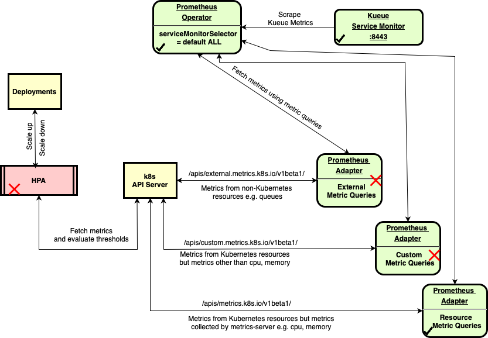

### Pre-requisites (assuming a macbook)
1. Install podman `brew install podman` 
2. Install yq `brew install yq`
3. Install jq `brew install jq`
4. Install promtool `brew install prometheus`
5. Install helm `brew install helm`
6. Install kubectl `curl -LO "https://dl.k8s.io/release/$(curl -L -s https://dl.k8s.io/release/stable.txt)/bin/darwin/arm64/kubectl;chmod +x kubectl;sudo mv kubectl /usr/local/bin/`
7. Create a container registry in OCI Console. Get regional OCIR endpoint e.g. phx.ocir.io
8. Create an auth token in OCI Console.
9. Login to phx.ocir.io using `podman login phx.ocir.io`. User name is <tenancy>/<OCI-user-name> e..g hpc_limited_availability/sam
10. Create an OKE cluster and download kubeconfig. `chmod 600 /Users/<user>/.kube/config` to make kubeconfig only read/writable for you.
11. Install krew for plugin management `https://krew.sigs.k8s.io/docs/user-guide/setup/install/`
12. Install Kustomize for patching manifests `curl -s "https://raw.githubusercontent.com/kubernetes-sigs/kustomize/master/hack/install_kustomize.sh"  | bash`


### Install kueue and dependencies
1. Install kueue `kubectl apply --server-side -f https://github.com/kubernetes-sigs/kueue/releases/download/v0.10.0/manifests.yaml`
2. Wait till install finishes `kubectl wait deploy/kueue-controller-manager -n kueue-system --for=condition=available --timeout=5m`
3. Install prometheus operator `kubectl create -f https://github.com/prometheus-operator/prometheus-operator/releases/download/v0.79.2/bundle.yaml`
4. Install kueue/prometheus `kubectl apply --server-side -f https://github.com/kubernetes-sigs/kueue/releases/download/v0.10.0/prometheus.yaml`
5. Install kueue priority plugin `kubectl apply --server-side -f https://github.com/kubernetes-sigs/kueue/releases/download/v0.10.0/visibility-apf.yaml`

### Build and push the application image
1. [uv](https://docs.astral.sh/uv/getting-started/installation/) is the package manager used for this project.
2. When adding new or removing dependencies use the following commands as an example
   ```
   #Run this when you cloned this repo first time
   uv init
   uv pip compile pyproject.toml -o requirements.txt
   #During active development (example)
   uv add prometheus_client
   uv remove prometheus-api-client
   uv pip compile pyproject.toml -o requirements.txt
   ```
3. Build app image `podman build -t phx.ocir.io/hpc_limited_availability/test:backend-kueue .`
4. Push app image to OCIR `podman push phx.ocir.io/hpc_limited_availability/test:backend-kueue`
5. `Makefile` helps organizing commands for building images, deploying. `make clean` to delete local images and generated manifests. `make` to rebuild image, push image to OCIR and deploy.
6. There may be times when you just need to run `make` to incrementally add features. You can scale deployment to 0 and scale it up to more replicas to force deployment to pull the new image. 
   ```
   kubectl scale deployment.apps/backend-kueue --replicas=0
   kubectl scale deployment.apps/backend-kueue --replicas=1
   ```

### Create Kueue objects
*NOTE* This is an example, production deployment requires more planning and design
1. Create a default flavor `kubectl apply -f default-flavor.yaml`
2. Create a cluster queue `kubectl apply -f cluster-queue.yaml`
3. Create a local queue `kubectl apply -f local-queue.yaml`

### Deploy App
1. Modify the `k8s-backend.template` to specify the image repo and image tag.
2. Generate secret and manifest all example objects.
    ```
    #use either Podman or Docker not both
    #Podman
    export DOCKER_CONF_JSON_BASE64=`cat ~/.config/containers/auth.json | base64`
    #Docker
    export DOCKER_CONF_JSON_BASE64=`cat ~/.docker/config.json | base64`
    sed -e "s/DOCKER_CONF_JSON_BASE64/$DOCKER_CONF_JSON_BASE64/g" k8s-backend.template > k8s-backend.yaml
    ```
 3. Deploy app `kubectl apply -f k8s-backend.yaml`
 4. Find the Load Balancer ip address `kubectl get svc`    
    Output looks like below and 141.148.171.46 is the public ip of the load balancer. In your case this would be different.
    ```
    kubectl get svc
    NAME                    TYPE           CLUSTER-IP      EXTERNAL-IP      PORT(S)             AGE
    backend-kueue-service   LoadBalancer   10.96.245.223   141.148.171.46   80:32484/TCP        19m
    kubernetes              ClusterIP      10.96.0.1       <none>           443/TCP,12250/TCP   8d
    prometheus-operator     ClusterIP      None            <none>           8080/TCP            27h
    ```
 5. Test app by running curl commands

    ```
    LOADBALANCER_IP=`kubectl get service backend-kueue-service -o jsonpath='{.status.loadBalancer.ingress[0].ip}'`
	 curl -s http://$LOADBALANCER_IP/health | jq -r '.status=="ok"'
    ```

    ```
    curl http://$LOADBALANCER_IP/
    {"message":"Hello from FastAPI and Gunicorn!"}

    curl http://$LOADBALANCER_IP/health
    {"status":"ok"}    
    ```
  6. Submit a kueue job via FastAPI

    ```
    curl -X POST http://$LOADBALANCER_IP/submit-job
    {"status":"submitted","queue":"local-queue","job":"job-c5k6l"}    
    ```
  7. Submit a kueue job using manifest `kubectl apply -f sample-job.yaml`

  8. Check the status of the job
    ```
    kubectl get jobs
    NAME          STATUS     COMPLETIONS   DURATION   AGE
    job1          Complete   1/1           7s         10s
    ```


### Access FastAPI metrics
1. Rationale: This will be part of our *custom* metrics for HPA to scale FastAPI deployment. The code `make_asgi_app` and `app.mount` are for Prometheus client library to instrument and collect metrics from FastAPI app and exposes them on `/metrics` endpoint.
2.  Get FastAPI metrics.  
> The trailing slash after metrics is important to see the FastAPI metrics using curl.
```
   curl -s http://$LOADBALANCER_IP/metrics/
```
3. Test to see if Prometheus is seeing these metrics
```
   kubectl port-forward -n monitoring svc/prom-kube-prometheus-stack-prometheus 9090:9090   
   promtool query instant http://localhost:9090 'fastapi_inprogress_requests_total'
```

### Access Kueue Metrics
1. Rationale: The Kueue metrics are considered *external* metrics for HPA to scale backend jobs.  
2. Create a service account which gives access to `/metrics` url `kubectl apply -f metrics-viewer-rbac.yaml`
3. Create a token from the service account 
```
export TOKEN=`kubectl create token metrics-viewer -n kueue-system`
```
4. Port forward the metrics service
```
kubectl port-forward -n kueue-system svc/kueue-controller-manager-metrics-service 8443:8443
```
5. Open another terminal tab/window and run
```
curl -k https://localhost:8443/metrics -H "Authorization: Bearer $TOKEN"
```
6. See `app.py` file and `get_prometheus_metric` method for an example that accesses the metrics programmatically. This file also includes a method `create_deployment` for creating a deployment and `scale_deployment` for writing custom scaling algorithm.
7. Check the `kueue` metrics are available via `prometheus`. Don't use `curl http://localhost:9090/metrics` which does not show metrics from exporters like kueue. Use promtool to get scraped metrics.
```
   kubectl port-forward -n monitoring svc/prom-kube-prometheus-stack-prometheus 9090:9090   
   promtool query instant http://localhost:9090 'kueue_pending_workloads'
```

### Cleanup workloads and jobs
```
kubectl delete workloads --all
kubectl delete jobs --all
``` 

### Horizontal Pod Autoscaler (HPA) integration

1. Use the above diagram understand the flow and identify the changes. The :x: mark in the diagram indicates components we need to configure. The :heavy_check_mark: in the diagram indicates configuration that was included in the install steps.
2. From the diagram, the missing piece is `prometheus-adapter` that scrapes metrics from prometheus endpoint and makes them available via API Server.
3. Configure prometheus-adapter
   1. Find prometheus service in your cluster. In my cluster the prometheus service name is `prom-kube-prometheus-stack-prometheus`. 
      ```
      kubectl get svc -n monitoring
      prom-kube-prometheus-stack-prometheus         ClusterIP   10.96.12.222    <none>        9090/TCP,8080/TCP   5d10h
      ```
   2. Check/Modify default url in `values.yaml`. Prometheus url would be in the format service-name.namespace.svc, so in my cluster prom-kube-prometheus-stack-prometheus is in monitoring namespace, hence the service url would be `prom-kube-prometheus-stack-prometheus.monitoring.svc`
   3. Install `prometheus-adapter` helm chart with our values.yaml
      ```
      helm repo add prometheus-community https://prometheus-community.github.io/helm-charts
      helm repo update
      helm install prom-adapter prometheus-community/prometheus-adapter -f values.yaml
      ```
   4. Check the custom and external metrics are available from Kubernetes API server
      ```
      kubectl get --raw /apis/custom.metrics.k8s.io/v1beta1 | jq | grep fastapi
      kubectl get --raw /apis/external.metrics.k8s.io/v1beta1 | jq | grep kueue
      ```
4. Configure the HPA


### Cluster Autoscaler

### Vertical Pod Autoscaler (VPA) integration

### Multidimensional Pod Autoscaler (MdPA) integration

### References
1. Prometheus Operator https://github.com/prometheus-operator/prometheus-operator
2. Kueue job example https://kueue.sigs.k8s.io/docs/tasks/run/python_jobs/
3. Install krew plugin manager https://krew.sigs.k8s.io/docs/user-guide/setup/install/
4. kueuectl https://kueue.sigs.k8s.io/docs/reference/kubectl-kueue/installation/
7. External metrics https://github.com/kubernetes-sigs/prometheus-adapter/blob/master/docs/externalmetrics.md
8. Kueue metrics https://kueue.sigs.k8s.io/docs/reference/metrics/#optional-metrics
9. Prometheus community helm charts https://github.com/prometheus-community
